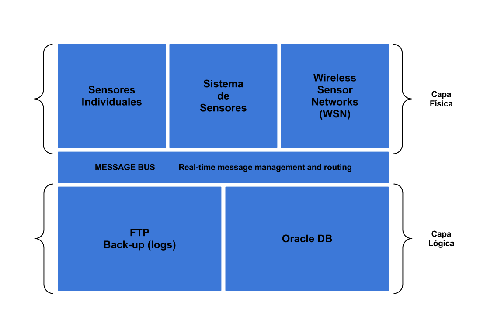
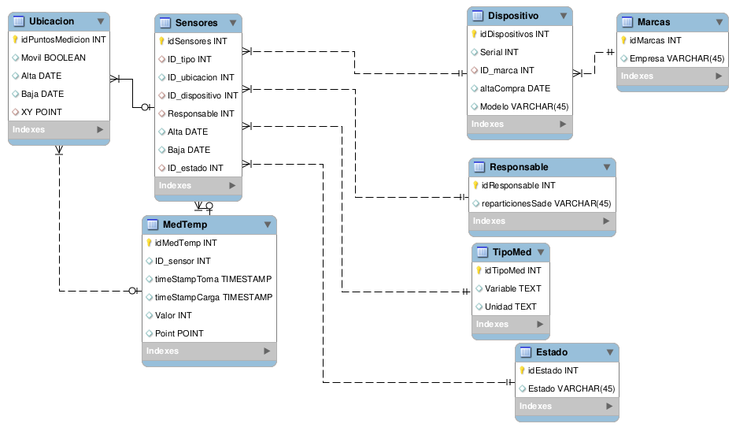

Estándar para datos de sensores (lite)
======================================

*Abstract: **el documento detalla cómo debe ser la estructura de los datos generados por cada sensor que pertenezca a la red de sensorización de la Ciudad Autónoma de Buenos Aires.*

[[TOC]]

# Antecedentes

Existen en la ciudad distintas áreas trabajando con diversos sensores. Esta información es capturada de manera ad-hoc utilizando diversos softwares y estándares muchas veces no homologados. Esta situación no sólo dificulta la integración de los datos sino que imposibilita contar con información precisa y, eventualmente crítica, en los tiempos requeridos. 

# Objetivo

Desarrollar y mantener una plataforma de integración que ofrezca la infraestructura necesaria para recolectar, filtrar y analizar estos datos, con el fin de convertirlos luego en sucesos sobre los cuales se puede actuar para impulsar la capacidad de respuesta de negocios ante las oportunidades y los riesgos del mundo real.

Esto supone definir tres cuestiones:

1. Normalización de los sensores que serán utilizados.

2. Normalización del formato de la información

3. Definición de una estructura funcional y base de datos / almacenamiento.

# Aclaraciones

El siguiente documento presenta un estándar de mínima, es decir que se exige que los sensores emitan un conjunto determinado de datos a una base de datos y un ftp determinado. De ninguna manera esto supone que los mismos sensores no puedan, adicionalmente, emitir otro tipo de información procesada, o con otros estándares con otros fines.

**Estructura funcional**

El estándar se basa en una estructura que contempla un protocolo de comunicación único para que todos los sensores que se conecten a la DB para dejar sus registros en tiempo real y al FTP para dejar sus logs históricos.

Básicamente, la estructura funcional del sistema físico de sensorización de la Ciudad de Buenos Aires debe dividirse en dos partes interconectadas: capa física y capa lógica.

* Capa Física: se compone de sensores y sistemas de sensores (sistemas complejos y redes de sensores WSN). Es la capa de ingreso de datos.

* Capa Lógica: es la capa donde se almacena la información generada en la capa física. El almacenamiento de la información es doble. Por un lado se reciben datos en tiempo real y se guardan en una base de datos. Por otro lado se guardan logs históricos con la misma información de la Base de datos en un servidor FTP.

# Estructura de la base de datos

La base de datos debe componerse de un conjunto de tablas que permitan obtener la información de localización de los sensores, información del tipo de sensor (estático o móvil, variable de medición) los valores agrupados por tipo (temperatura, humedad, presión, ruido, etc). 

**Diagrama de la base de datos v.0.1**

# Formato de los eventos de sensores

**Aclaración**: Los eventos que se generan en formatos no compatibles deben ser convertidos antes de ser enviados a la base de datos. 

## Tipos de datos permitidos

En la siguiente tabla se listan los tipos de datos que se usarán en los campos de la base de datos:

Temporales
Numéricos
Cadena de caracteresDATETIME
NULL
CHARDATE
AUTO_INCREMENT
VARCHARTIMESTAMP
SERIAL
BINARYTIMESTAMP (with time zone)
BIT[(M)]
VARBINARY
TINYINT[(M)]
BLOB
BOOL, BOOLEAN
TEXT
SMALLINT[(M)]
ENUM
MEDIUMINT[(M)]
SET
INT[(M)]

INTEGER[(M)]

BIGINT[(M)]

FLOAT(p) - BINARY_FLOAT

FLOAT[(M,D)]

DOUBLE[(M,B)]- BINARY_DOUBLE

DECIMAL[(M[,D])]

### Estructura de datos temporales

Los tipos a usar para los campos temporales son DATETIME, DATE, y TIMESTAMP. Estos formatos están relacionados debido a que son medidas temporales, sin embargo, tienen diferentes usos.

### Formato válido para datos temporales (NOTE:  Los valores ilegales de DATETIME, DATE, o TIMESTAMP se convierten en la base de datos al valor "cero" del tipo apropiado ('0000-00-00 00:00:00', '0000-00-00', o 00000000000000).)

Tipo de dato
Formato de envio
Formato en DBDATETIME
'98-12-31 11:30:45',
'98.12.31 11+30+45',
'98/12/31 11*30*45', '98@12@31 11^30^45'
YYYY-MM-DD HH:MM:SS
YY-MM-DD HH:MM:SSDATE
'19970523'
'970523'
YYYYMMDD
YYMMDDDATE, DATETIME y TIMESTAMP
(Preferentemente TIMESTAMP)

NOW()
CURRENT_DATE

## Estructura de datos numéricos

Se soportan formatos SQL numéricos estándar. Estos tipos incluyen los tipos numéricos exactos (INTEGER, SMALLINT, DECIMAL, y NUMERIC), así como los tipos de datos aproximados (FLOAT, REAL, y DOUBLE PRECISION).

Tipo
Bytes
Valor mínimo
Valor máximo

(Con signo/Sin signo)
(Con signo/Sin signo)TINYINT
1
-128
127

0
255SMALLINT
2
-32768
32767

0
65535MEDIUMINT
3
-8388608
8388607

0
16777215INT
4
-2147483648
2147483647

0
4294967295BIGINT
8
-9223372036854775808
9223372036854775807

0
18446744073709551615

## Estructura de datos espaciales

Este documento implementa un conjunto de Tipos Geométricos propuesto por la OGC. Una columna con valores geométricos se implementa como una columna que tiene un tipo geométrico. Un elemento geográfico es cualquier cosa en el mundo que tenga una ubicación (en nuestro caso sería una medición). Un elemento puede ser:

* Una entidad. Por ejemplo, un sensor, un nodo, un punto de acceso.

* Un espacio. Por ejemplo, un barrio o un área de la Ciudad de Buenos Aires.

* Una ubicación definible. Por ejemplo, un cruce de calles.

### Tipo de dato POINT

Un Punto es una geometría que representa una ubicación única en un espacio de coordenadas. Las propiedades de este tipo de datos son:

* Valor de la coordenada X.

* Valor de la coordenada Y.

* Point es definido como una geometría cero-dimensional.

* El límite de un Point es el conjunto vacío.

### Formato de datos de localización normalizados

Esta sección describe los formatos de datos espaciales estándar que suelen utilizarse para representar objetos geométricos en consultas. Son:

* Formato Well-Known Text (WKT)

* Formato Well-Known Binary (WKB)

*Ejemplo de formato WKB*

0101000000000000000000F03F000000000000F03F

La secuencia puede descomponerse en los siguientes componentes:

Orden de byte : 01

Tipo WKB           : 01000000

X             : 000000000000F03F

Y             : 000000000000F03F

### Proyección

En todos los casos la proyección de los datos geográficos será WGS84 (epsg projection 4326) tal como es definida por la NGA (NOTE:  http://earth-info.nga.mil/GandG/publications/tr8350.2/tr8350_2.html) (estándar para los sistemas de GPS) sin detrimento que el GCBA los convierta, con posterioridad, a la proyección oficial (GKBA).

# Unidades

Variable
UnidadTemperatura
°C (Grados Celsius)Humedad
% (valor numérico)Presión
BarLuz
LuxRuido
dB (decibeles)

(Siguiendo estándar SIMELA excepto en el caso de LUX)

# Referencias

* [ISO 8601](http://en.wikipedia.org/wiki/ISO_8601)

* [API de Xively](https://xively.com/dev/docs/api/)

* [OASIS](https://www.oasis-open.org)

* [Web Services Distributed Management](https://www.oasis-open.org/committees/tc_home.php?wg_abbrev=wsdm)

* [OPENGIS](http://www.opengis.org/)

